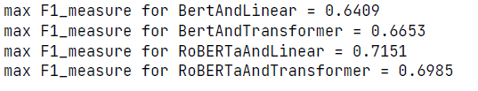

<h1 align='center'>ABSA-Aspect-Based-Sentimental-Analysis</h1>
<h3 align='center'>《知识工程》大作业4实验报告</h3>

### 1. 实验内容介绍
&emsp;&emsp;本次实验的内容是利用深度神经网络，完成自然语言处理中的**情感抽取任务**。本模型完成的情感抽取任务是基于实体的细粒度情感分析（ABSA），从一段评论当中抽取其中被评论的实体并检测其情感极性。

&emsp;&emsp;值得注意的是，与句子级别的情感分析任务不同，一个句子中可能含有多个不同的实体，每个实体的情感极性可能不同。因此，基于实体的细粒度情感分析有很多实际应用价值。如针对商品评论的实体的情感分析可以提取用户对一个商品不同部分/方面的评价，为厂商进一步改进商品提供更细粒度的参考。

&emsp;&emsp;任务以英文文段为例。其中，每个**实体**包含一个或者多个相邻的单词；**情感**分为*积极*（Positive）、*中立*（Neutral）、*消极*（Negative）三种。

### 2. 任务的形式化以及模型介绍
&emsp;&emsp;本任务可形式化为序列标注任务[1]。输入为经过符号化且长度为 $T$ 的序列 $\mathbf{x} = \{ x_1,...,x_T\}$ ，我们利用**BERT**[2]或者**RoBERTa**[3]预训练模型来得到每个词的上下文相关的表示 $H^L = \{ h_1^L,...,h_T^L\} \in \mathbb{R}^{T \times dim_h}$，其中 $dim_h$ 代表每个表示向量的维度。然后，这些上下文相关的表示继续输入一个线性网络层或者**Transformer Encoder**层来获得目标标签序列。

&emsp;&emsp;目标标签序列可以形式化为 $\mathbf{y} = \{ y_1,...,y_T\}$ ，其中 $y_t \in \{B_{POS},B_{NEU},B_{NEG},I_{POS},I_{NEU},I_{NEG},O\}$ ，表示一个积极（POS）、中立（NEU）、消极（NEG）实体的开头或者中间部分，或者当前词语不属于需要识别的实体（O）。

&emsp;&emsp;根据预训练模型的不同和顶层模型的不同，我们可以构建4个不同的模型，分别为**BERT**+`Linear`层、**BERT**+`Transformer Encoder`层、**RoBERTa**+`Linear`层、**RoBERTa**+`Transformer Encoder`层。

&emsp;&emsp;然而预训练模型有可能对于预训练任务有一定程度的过拟合现象，为了消除这种影响，在对于预训练微调前，可加入随机噪声来获得更好的效果。[4]

### 3. 训练数据以及其预处理过程
&emsp;&emsp;本实验在三个不同的数据集上训练和测试。其中前两个数据集来源于Semeval2014比赛中对于笔记本电脑（Laptop14）和餐厅（Restaurant14）的评论，第三个数据集来源于Twitter上的评论。需要注意，第三个数据集的质量相较于前两个数据集较差。使用的数据集可能相较于原始数据经过处理，训练集和测试集的分割方法和原始数据相同。

&emsp;&emsp;由于**BERT**模型和**RoBERTa**模型的分词器使用方法有些许不同，因此针对这两种模型使用了不同的预处理方法。

&emsp;&emsp;**BERT**模型的分词器将空格视为分隔符，因此可以根据每个单词被拆分的个数来确定句子的长度。而**RoBERTa**模型的分词器将空格视作句子的一部分，且句首单词将被单独考虑，因此必须使用`return_offsets_mapping`来确定每个词对应于分词完成后句子的哪个部分。
### 4. 训练过程
&emsp;&emsp;构建模型后，使用`AdamW`优化器进行梯度下降，统一超参数：批大小`batch_size=16`、训练次数`epoch=40`、学习率`learning_rate=2e-5`、权重衰减`weight_decay=1e-4`。

&emsp;&emsp;记录训练过程中的损失以及其在测试集上的F1值。
#### 4.1 对于预训练模型不添加噪声
##### 4.1.1 Laptop14

##### 4.1.2 Resaurant14

##### 4.1.3 Twitter

#### 4.2 对于预训练模型添加噪声
##### 4.2.1 Laptop14

##### 4.2.2 Resaurant14

##### 4.2.3 Twitter

### 5. 实验结果
#### 5.1 实验结果对比
&emsp;&emsp;对比**BERT**+`Linear`层（BL）、**BERT**+`Transformer Encoder`层（BT）、**RoBERTa**+`Linear`层（RL）、**RoBERTa**+`Transformer Encoder`层（RT）四种模型在不同数据集中以及是否在预训练模型中添加噪声的最佳的F1值表格。
||Laptop14|Resaurant14|Twitter|
|--|--|--|--|
|BL|0.6405|0.7339|0.7082|
|BL(noise)|0.6409|0.7191|0.7115|
|BT|0.6562|0.7310|0.7220|
|BT(noise)|0.6653|0.7372|0.7330|
|RL|0.7199|0.7572|0.7619|
|RL(noise)|0.7151|**0.7608**|**0.7639**|
|RT|**0.7442**|0.7549|0.7525|
|RT(noise)|0.6985|0.7577|0.7456|

#### 5.1 实验结果分析
&emsp;&emsp;首先可以发现，使用**RoBERTa**作为预训练模型相较于**BERT**，在所有数据集上训练效果更好（两者皆为`Base`模型，参数个数相差不大），说明**BERT**模型预训练过程确实存在*欠拟合*现象。

&emsp;&emsp;其次，使用`Transformer Encoder`层作为最后一层网络层对于模型在特定数据集和模型上才有较好效果，没有显著的规律，可能是由于预训练模型已经较为适合完成情感分析的下游任务。

&emsp;&emsp;最后，添加随机噪声对于某些实验结果的提升虽然规律性不强，但是还是值得我们注意的，可以作为微调预训练模型的技巧之一，可能可以很轻易得获得更好结果。要获得更好的结果，可能还需要对于噪声大小`noise_lambda`这个超参数进行调节。
### 6. 额外工作
&emsp;&emsp;将所有训练数据合并，利用最佳模型进行训练，并将最后标签序列解码就可以得到一个基于实体的情感分析器。基于**BERT**分词器的相关示例代码在`predict.py`中。
### 7. 参考文献
[1]Li, X., Bing, L., Zhang, W. and Lam, W., 2019. Exploiting BERT for end-to-end aspect-based sentiment analysis. arXiv preprint arXiv:1910.00883.

[2]Devlin, J., Chang, M.W., Lee, K. and Toutanova, K., 2018. Bert: Pre-training of deep bidirectional transformers for language understanding. arXiv preprint arXiv:1810.04805.

[3]Liu, Y., Ott, M., Goyal, N., Du, J., Joshi, M., Chen, D., Levy, O., Lewis, M., Zettlemoyer, L. and Stoyanov, V., 2019. Roberta: A robustly optimized bert pretraining approach. arXiv preprint arXiv:1907.11692.

[4]Wu, C., Wu, F., Qi, T., Huang, Y. and Xie, X., 2022. NoisyTune: A Little Noise Can Help You Finetune Pretrained Language Models Better. arXiv preprint arXiv:2202.12024.